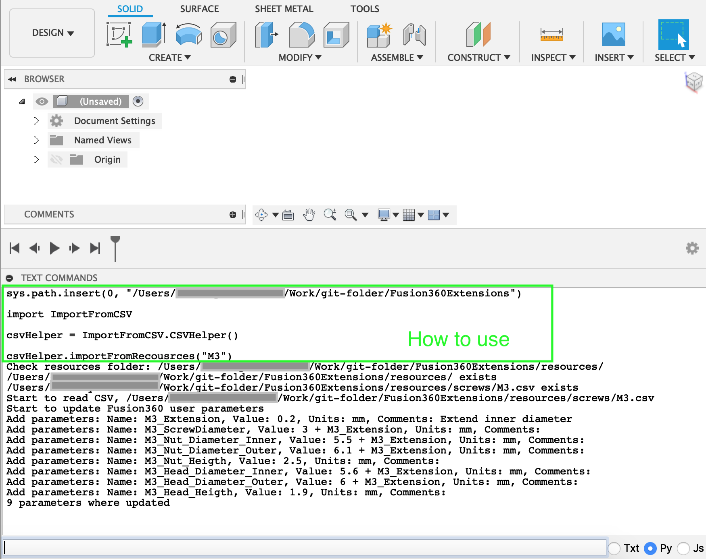
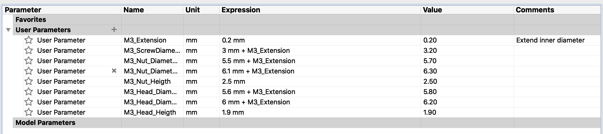

# Fusion360Extensions
This is a Fusion360 extensions python project

# All commands need to be writen in to `Text Command` field with `py` enabled.
# To load module
import sys; sys.path.insert(0, "your path to the module folder")
import ImportFromCSV

# To reload module, usualy you can use it if you cnange a module and want to reload it
import importlib
importlib.reload(ImportFromCSV)

# To use
csvHelper = ImportFromCSV.CSVHelper()
csvHelper.importFromRecousrces("M3")

# Don't forget to remove system path that you added
sys.path.remove("your path to the module folder")

# Example
1. Create new design
2. Type Scrypt

3. Check that everything is right
